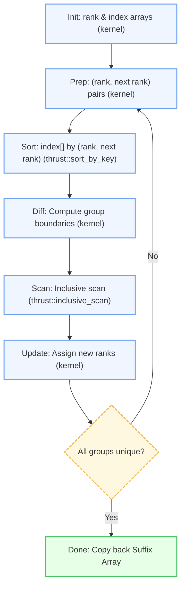
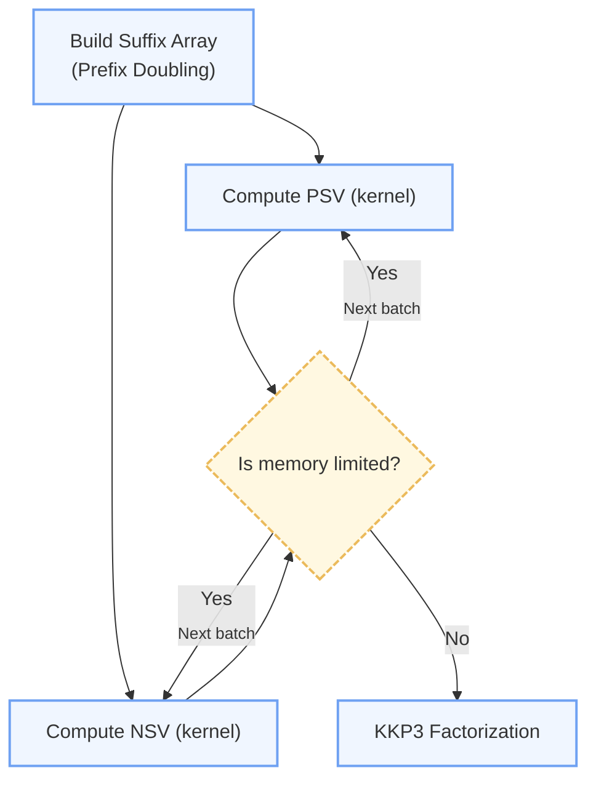
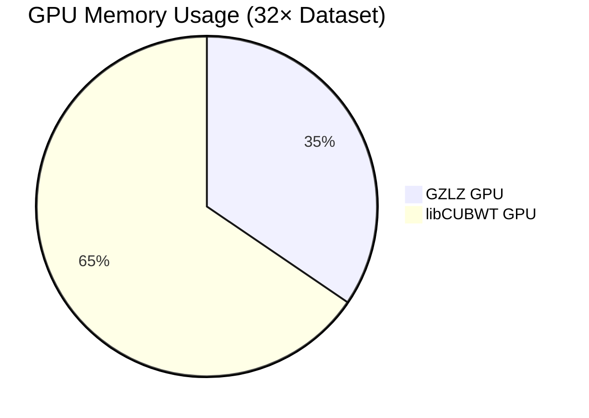

# **GZLZ** — GPU-Accelerated LZ77 Compression

[](#license)
[](https://github.com/kobolabs/libcubwt)
[](https://github.com/simongog/sdsl-lite)


GZLZ is an advanced GPU-accelerated toolkit designed specifically for efficient suffix array (SA) construction and LZ77 compression algorithms. Leveraging cutting-edge CUDA implementations, GZLZ significantly enhances speed and memory efficiency, making it ideal for bioinformatics and large-scale data compression tasks.

---

## Key Highlights

* **Optimized GPU Algorithms:** Achieves superior speed over traditional CPU libraries and superiour memory efficiency over existing GPU libraries.
* **Tailored for Bioinformatics:** Specifically optimized for massive genomic datasets.
* **Memory-Efficient Compression:** Stream-based processing suitable for extremely large datasets.

---

## Performance Benchmarks

Tested on NVIDIA A100 GPU (80 GB VRAM):

| Dataset          | Method              | Runtime (ms)    | GPU Peak Memory (MiB) | Speedup vs CPU |
| ---------------- | ------------------- | --------------- | --------------------- | -------------- |
| **32× (1.8 GB)** | libCUBWT (GPU)      | 10,449          | 55,252                | **25.83×**     |
| **32× (1.8 GB)** | **GZLZ (GPU)**      | **96,886**      | **29,356**            | **2.78×**      |
| **32× (1.8 GB)** | SDSL (CPU, 32-core) | 269,883         | —                     | 1.00×          |
| **64× (3.7 GB)** | libCUBWT (GPU)      | —               | —                     | —              |
| **64× (3.7 GB)** | **GZLZ (GPU)**      | **294,324**     | **58,806**            | **2.05×**      |
| **64× (3.7 GB)** | SDSL (CPU, 32-core) | 604,863         | —                     | 1.00×          |

---

## Understanding the Algorithms

### What is a Suffix Array?

A suffix array is a data structure that stores the starting indices of all suffixes of a given string, sorted in lexicographic (dictionary) order. By organizing the string's suffixes this way, it enables highly efficient solutions to common string-processing tasks such as substring search, longest repeated substring detection, and pattern matching. **We compute the Suffix Array using Prefix Doubling**

**Example:**

```
String: "BANANA"
Sorted Suffixes:
0: A
1: ANA
2: ANANA
3: BANANA
4: NA
5: NANA
```

### Prefix Doubling Architecture & Kernel Flow

GZLZ implements an efficient **Prefix Doubling Suffix Array** construction on the GPU, orchestrating multiple CUDA kernels and memory operations to maximize parallel throughput while minimizing memory footprint.
Each iteration doubles the prefix length and re-ranks suffixes using a series of compute, sort, and scan operations. The flow is fully adaptive, monitoring device memory to select either full-GPU or streaming mode.

#### **GPU Kernel/Operation Pipeline**



####  **Key Optimizations**

* **In-place Memory Reuse:**
  Intermediate buffers are reused, minimizing allocations.
* **Streaming & Adaptive Modes:**
  If input size exceeds memory, GZLZ splits into batches and pipelines the doubling.
* **Profiling Hooks:**
  Each step is profiled for fine-grained analysis and bottleneck detection.

---


### What is LZ77 Compression?

LZ77 is a foundational algorithm for lossless data compression. It replaces repeated substrings with references to their previous occurrences, representing data as a sequence of **(offset, length, next character)** triples.
This drastically reduces storage for highly repetitive or structured data, making it crucial in genomic compression and other large-scale data applications.

#### **Factorization Pipeline in GZLZ**

GZLZ accelerates LZ77 factorization on the GPU by exploiting suffix arrays for rapid substring matching and utilizing parallel primitives to compute candidate matches efficiently.

1. **Suffix Array Construction:** Build the suffix array for the input string (using GPU prefix doubling as above).
2. **PSV/NSV Computation:** For each position, compute the Previous Smaller Value (PSV) and Next Smaller Value (NSV) in the suffix array, representing lexicographically closer neighbors.
3. **Factor Extraction:** For each position, select the neighbor (PSV or NSV) yielding the longest match, and encode the (offset, length, next character) triple.
4. **Streaming/Batching:** For datasets exceeding GPU memory, the pipeline dynamically streams suffix array segments and merges matches across batch boundaries.

**Example:**

* First `"BANANA"`: Encoded as literal.
* Second `"BANANA"`: Encoded as `(offset=0, length=6, next='_')`, etc.

#### **GPU Kernel Flow for LZ77 (Batch & Streaming)**



#### **Why PSV & NSV Matter**

Let \$SA\$ be the suffix array for \$T\$, and \$i\$ an index in \$SA\$:

* **PSV(i):** The closest suffix before \$i\$ in SA, such that \$SA\[j] < SA\[i]\$ and \$j < i\$.
* **NSV(i):** The closest suffix after \$i\$ in SA, such that \$SA\[j] < SA\[i]\$ and \$j > i\$.

By comparing the match lengths for \$PSV(i)\$ and \$NSV(i)\$, we efficiently find the longest leftward match.

$$
\mathrm{LZ77\_factor}(i) = \max \left\{ \mathrm{lcp}(T[i..],\ T[\mathrm{PSV}(i)..]),\ \mathrm{lcp}(T[i..],\ T[\mathrm{NSV}(i)..]) \right\}
$$

#### **Key GZLZ LZ77 Optimizations**

* **Blockwise Kernels:** Compute PSV/NSV in parallel blocks with batch merging for ultra-large files.
* **Text Order Mapping:** GPU text-order transforms for faster extraction and output.
* **Memory Adaptivity:** Automatic switching to streaming when memory is tight, with seamless batch merging logic.
* **Profiling/Instrumentation:** Every LZ77 phase profiled for speed and bottleneck analysis.

---

## Visualizations

### GPU Memory Usage Comparison



---

## Bioinformatics & Compression Applications

GZLZ directly targets critical needs in bioinformatics, where genomic data volumes explode exponentially. Optimized GPU implementations allow researchers and practitioners to handle larger datasets efficiently, accelerating genome assembly, sequence alignment, and high-throughput data compression workflows.

---
